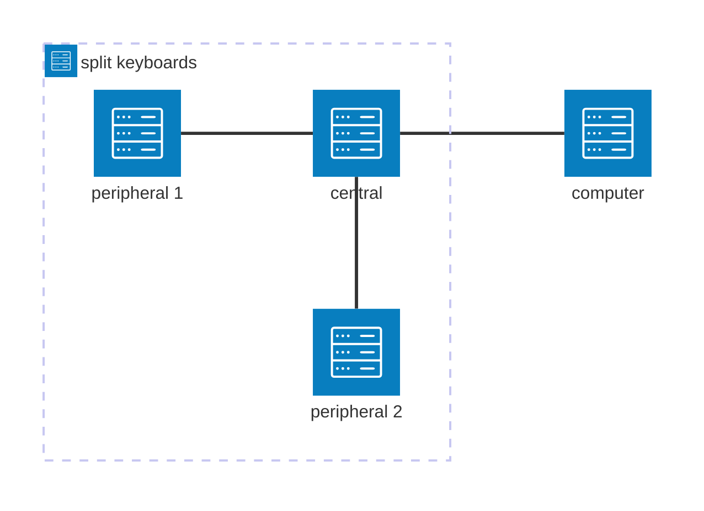

# Build a Sofle Wireless Keyboard

The internet is an amazing trap. I was looking for an ergonomic keyboard to buy. And I ended up building one.

This repository records my building log. This project is my first big embedded project. I hope the repository can be a good reference for people who want to build a wireless keyboard or a similar project.

The build recipe is based on the [Sofle Choc Wireless Keyboard](https://github.com/db-ok/SofleChocWireless). However, my demand is a bit different in the following ways:

- palm rest.
- joycon as a mouse.
- traditional profile switches.

> I know I can get a prebuild one exactly satisfying my needs at around 100 dollars from Aliexpress. However I still want to make one just for learning, and for fun.

## What makes the keyboard wireless

[Sofle Choc Wireless Keyboard](https://github.com/db-ok/SofleChocWireless) differs from the original [Sofle Choc Keyboard](https://github.com/josefadamcik/SofleKeyboard) in the framework. 

| Feature | QMK | ZMK | 
|---------------------------|-------------------------------------------------------------------------|-------------------------------------------------------------------------|
| Primary Use Case | Wired and highly customizable mechanical keyboards. | Wireless (Bluetooth) keyboards with a focus on low-power efficiency. | | Wireless Support | Limited (e.g., via add-ons like Bluefruit or custom solutions). | Native Bluetooth Low Energy (BLE) support. | | Programming Language | C (with custom build system). | C (built on Zephyr RTOS for embedded systems). | | Configuration | Code-based (C, keymap.c) or GUI tools (VIA/QMK Configurator + JSON). | Declarative via Devicetree (DT) overlays and YAML keymaps. |
| Hardware Support | Broad (AVR, ARM-based MCUs like STM32, RP2040). | Focused on ARM MCUs with BLE (e.g., Nordic nRF52 series). | 
| Community & Ecosystem | Large, mature community with extensive documentation and forks. | Growing community, focused on wireless use cases. |
| Power Management | Minimal (not optimized for battery life). | Advanced (deep sleep, peripheral power control for long battery life). | | Licensing | GPL-2.0+ (open source, copyleft). | MIT (permissive open source). |
| Example Boards | Planck, Lily58, Drop CTRL, Keebio Quefrency. | Nice!Nano-based builds (e.g., Corne, Kyria), Wireless Split keyboards. |

We don't look for more advanced/suitable frameworks in this repository. From this comparision we know our framework of choice should be ZMK. Simply because I like wireless. My wishlist was generously fulfilled by [ZMK docs](https://zmk.dev/docs)

> One thought: ZMK supports setups where a keyboard is split into two **or more** physical parts. How cool is that if I can include paddle(s) in the keyboard?

The idea would be interesting. But I don't have the time to implement it. So I just stick to the original plan.

## Cost estimate

## Project management

## Worklog

### Change choc switches to standard switches
